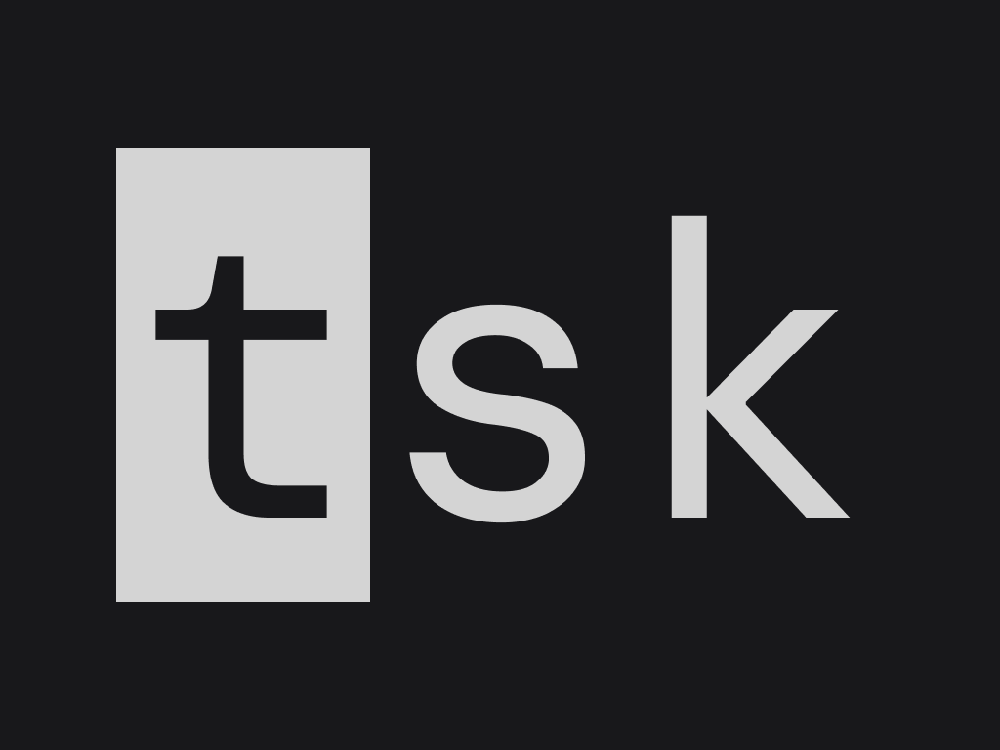

<p align="center">
  
</p>

# tsk

**tsk** is a fast, lightweight, and flexible command-line todo manager built in
C#. It uses a simple plaintext file to store tasks and supports features like
tagging, due dates, and locations.

> **Version:** `0.2.0` (See the [Changelog](CHANGELOG.md) for release notes.)

---

## Table of Contents

- [📦 Installation](#-installation)
  - [Prebuilt Binaries](#prebuilt-binaries)
  - [Building from Source](#building-from-source)
  - [Adding `tsk` to Path](#adding-tsk-to-path)
- [🚀 Basic Usage](#-basic-usage)
  - [Create a Task](#create-a-task)
  - [List Tasks](#list-tasks)
    - [Sorting](#sorting)
  - [Mark as Done](#mark-as-done)
  - [Update a Task](#update-a-task)
  - [Delete a Task](#delete-a-task)
- [🧩 Metadata Support](#-metadata-support)
  - [Tags](#tags)
    - [New Tasks](#new-tasks)
    - [Update Task Tags](#update-task-tags)
  - [Location](#location)
  - [Due Date](#due-date)
- [📝 Plaintext Editing](#-plaintext-editing)
- [🛣 Roadmap Features](#-roadmap-features)
- [🧱 Architecture Overview](#-architecture-overview)
- [🧪 Running Tests](#-running-tests)

---

## 📦 Installation

### Prebuilt Binaries

You can download prebuilt binaries from the [Releases
page](https://github.com/bradleyburgess/tsk/releases). Binaries are provided as
`.tar.gz` (Linux/macOS) or `.zip` (Windows) archives. Extract and move to your
`PATH`.


### Building from Source

Alternatively you can build the project with the .NET SDK:

```bash
git clone https://github.com/bradleyburgess/tsk.git
cd tsk
dotnet publish -c Release -r linux-x64 --self-contained true -p:PublishSingleFile=true -o out
````

### Adding `tsk` to Path

(Optional) Add the binary to your `PATH`:

```bash
cp tsk ~/.local/bin/  # or /usr/bin, or Windows equivalent
```

---

## 🚀 Basic Usage

First, check things are working correctly:

```bash
tsk --help      # or
tsk --version

```

Tsk uses a flat text file (`tsk.txt`) stored by at:

```
~/.local/share/tsk/tsk.txt                       # Unix-like systems (MacOS, Linux)
C:\Users\<username>\AppData\Roaming\tsk\tsk.txt  # Windows (%APPDATA%)
```

You can override this with `--file`:

```bash
tsk list --file ~/custom/tasks.txt
```

### Create a Task

```bash
tsk add "Write documentation"
tsk a   # alias
```

### List Tasks

```bash
tsk list
tsk l     # alias
```

#### Sorting

By default, the list is sorted with incomplete tasks first.

You can also sort the list by description (`"description"|"desc"`), location
(`"location"|"loc"`) or date (`"duedate"|"date"`):

```bash
tsk list --sort-by desc  # or `description`
tsk list --sort-by loc   # or `location`
tsk list --sort-by date  # or `duedate`
```

### Mark as Done

All commands take the `<id>` as an argument, which you can see via `tsk list`

```bash
tsk complete 1
tsk done 1     # alias
tsk x 1        # alias
tsk check 1    # alias
```

You can also mark something as **not** done. (Perhaps you changed your mind or forgot something!)

```bash
tsk incomplete 1
tsk notdone 1      # alias
tsk o 1            # alias
tsk uncheck 1      # alias
```

### Update a Task

You can update a task:

```bash
tsk update 1 "buy milk"
tsk update 1 --loc "Trader Joes"
tsk u 1 --date 20250401
```

### Delete a Task

```bash
tsk delete 2
tsk del 2     # alias
tsk d 2       # alias
```

---

## 🧩 Metadata Support

Add due dates, tags, and locations to tasks:

```bash
tsk add "Groceries" --due 20240505 --tags shopping,errands --loc "Pick n Pay"
```

### Tags

NB: Tags are supplied in a comma-separated list.

#### New Tasks

Tags can be supplied when adding a task:

```bash
tsk add "buy milk" --tags groceries,errands
```

#### Update Task Tags

Or tags can be updated on an existing task:

```bash
tsk update 1 --add-tags urgent      # adds tag(s)
tsk update 1 --remove-tags urgent   # removes tag(s)
tsk update 1 --tags urgent,errands  # replaces tag(s)
tsk u 1                             # alias
```

### Location

You can set a task location with the `--loc` flag:

```bash
tsk add "go for a walk" --loc "Alphen trail"
```

### Due Date

You can set a task due date:

```bash
tsk add "buy milk" --date 20250504
```

**Note:** Dates are in the `yyyyMMdd` format.

---

## 📝 Plaintext Editing

You can edit the plaintext file by hand if you wish! It uses the following DSL /
format:

```
[X] 20250503 "buy milk" loc:"Shoprite" tags:groceries,errands
[ ] "incomplete task"
```

---

## 🛣 Roadmap Features

* [ ] Filtering tasks
* [ ] Sorting tasks in memory or on disk
* [ ] Config file support
* [ ] Export to JSON/CSV

---

## 🧱 Architecture Overview

Tsk is organized into:

* `Tsk.CLI/` — Command-line interface
* `Tsk.Domain/` — Core domain logic (entities, validation)
* `Tsk.Infrastructure/` — File I/O and persistence

The project uses the Repository Pattern, clean layering, Dependency Injection,
and `Spectre.Console.Cli` for structured CLI behavior.

---

## 🧪 Running Tests

```bash
dotnet test
```

---

MIT License · © [Bradley Burgess](https://github.com/bradleyburgess)